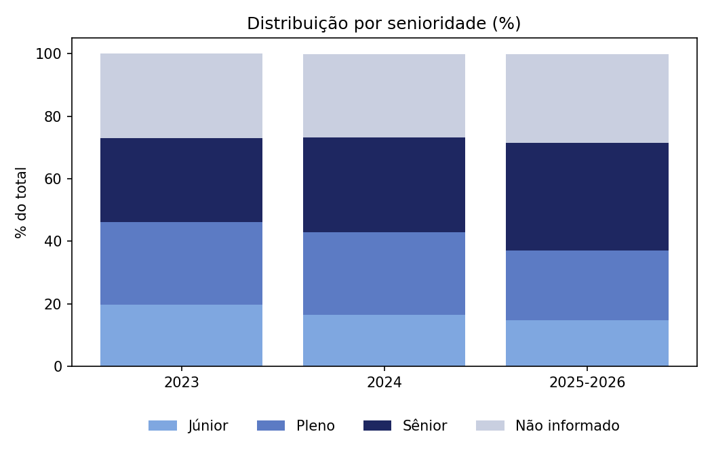
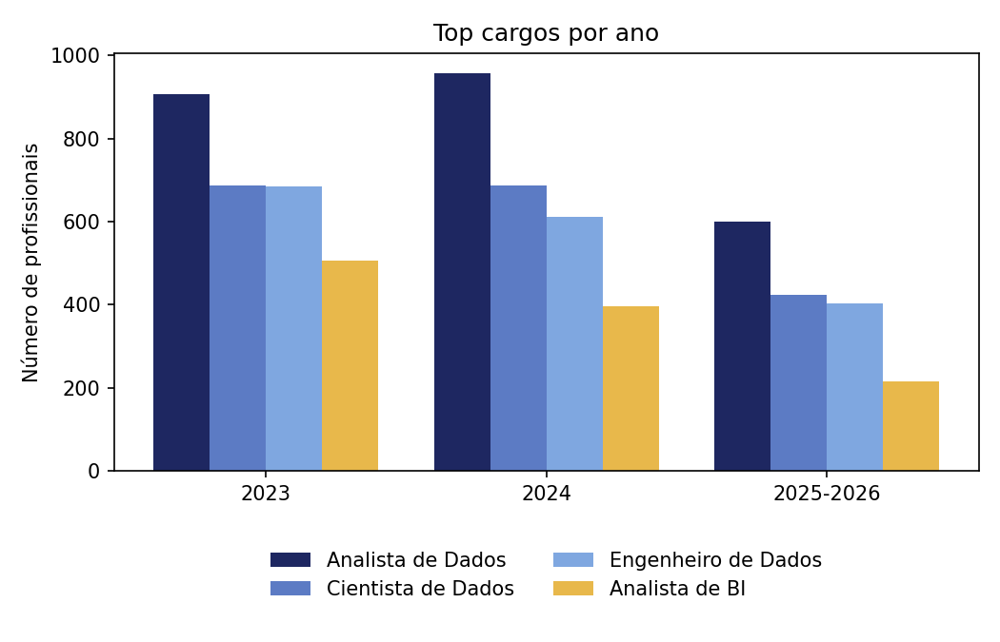
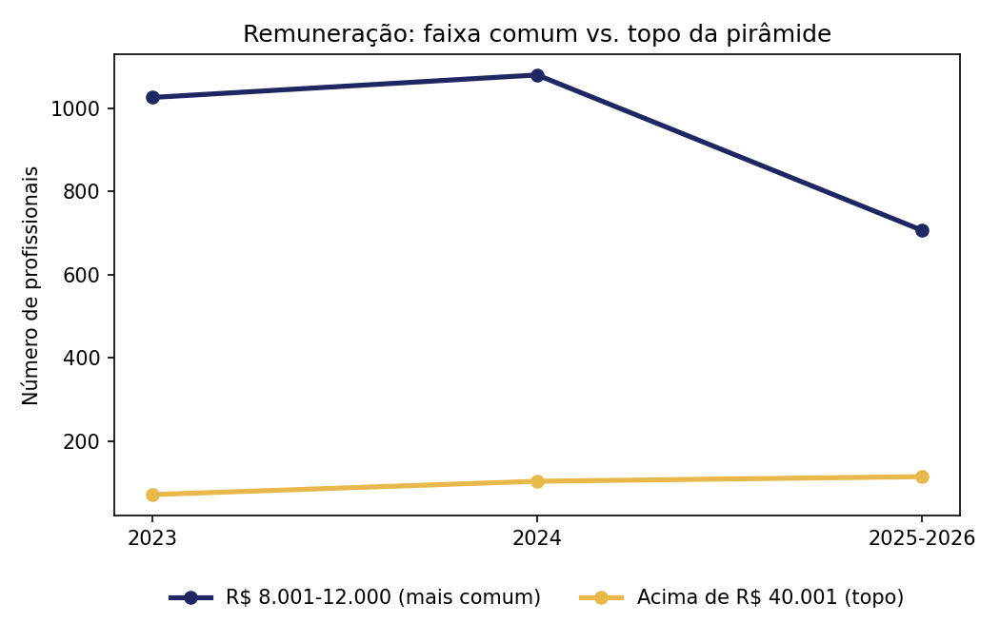
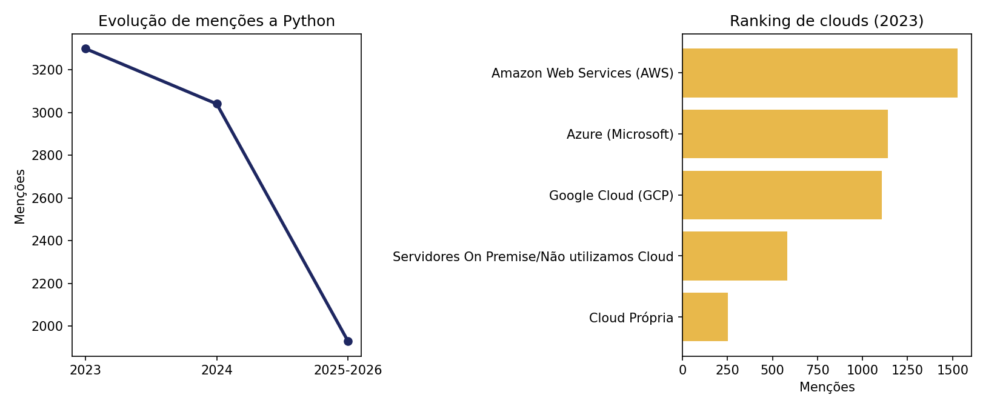
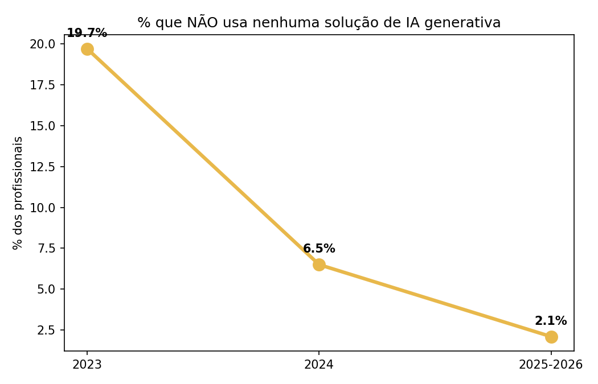
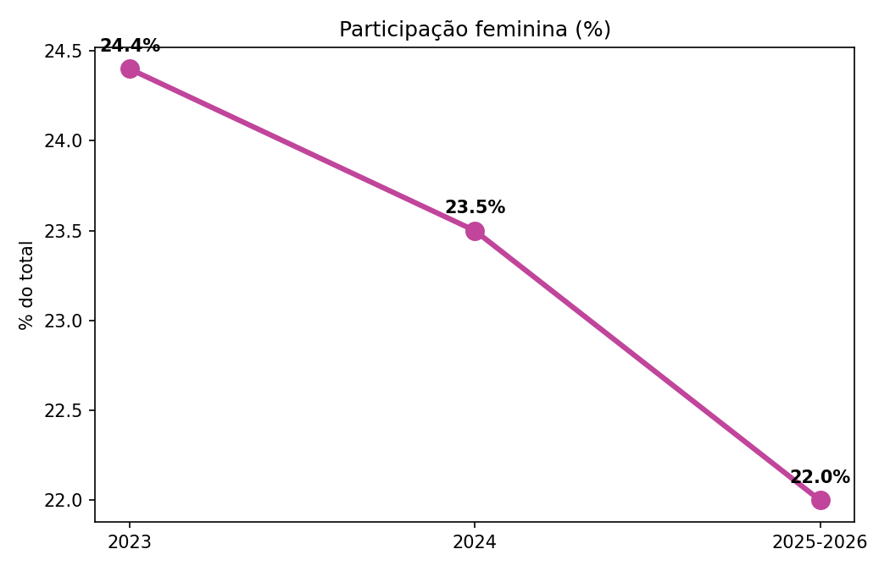
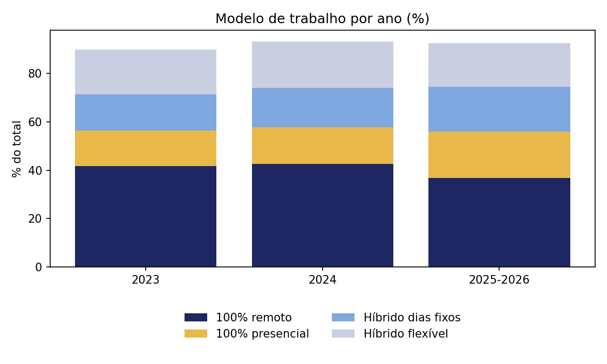
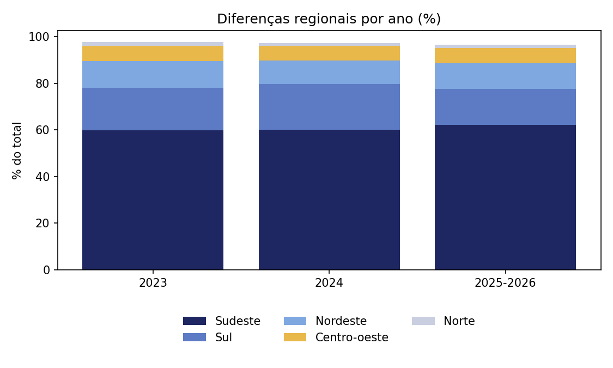

# Tech Challenge Fase 3 - O Mercado Brasileiro de Dados

**Autor: Pedro Eduardo Garcia Silva - rm374179**

## Problema de negócio

> "Como evoluiu o mercado brasileiro de Dados entre 2023 e 2025/2026 e quais competências, tecnologias, perfis profissionais e características de trabalho devem ser consideradas por uma instituição financeira que pretende expandir sua área de Dados, Analytics e Inteligência Artificial?"

A instituição precisa de evidência de dados para decidir sobre **contratação, capacitação, investimento em tecnologia, desenvolvimento de profissionais, estratégia de IA e retenção de talentos**.

## Objetivos

| Frente | O que a análise responde |
|---|---|
| Contratação | Quais perfis, cargos e senioridades priorizar |
| Capacitação | Quais competências desenvolver internamente |
| Tecnologia | Quais linguagens, clouds e ferramentas priorizar |
| Estratégia de IA | Como preparar os times para a adoção já quase universal |
| Localização | Onde está concentrado o talento no Brasil |
| Retenção | Quais fatores de trabalho pesam na permanência |

## Fonte dos dados

Pesquisa **State of Data Brasil**, realizada pela comunidade **Data Hackers** em parceria com a **Bain**. Utilizadas as **3 pesquisas mais recentes disponíveis** nos arquivos fornecidos:

| Ano | Arquivo | Linhas | Colunas | Duplicidades (bruto) |
|---|---|---:|---:|---:|
| 2023 | `state_of_data_2023.csv` | 5.293 | 399 | 0 |
| 2024 | `state_of_data_2024.csv` | 5.217 | 403 | 2 |
| 2025-2026 | `state_of_data_2025-2026.csv` | 3.495 | 388 | 1 |

> ⚠️ **PS:** Há arquivos dos 3 anos mais recentes efetivamente disponíveis são 2023, 2024 e 2025-2026 (confirmado e decidido no início do projeto).

Diagnóstico estrutural completo (nulos, padrão de nomenclatura, amostras) em [`exploracao_CSV.ipynb`](exploracao_CSV.ipynb).
---

**Fonte dos dados:** [State of Data Brasil — Data Hackers](https://www.kaggle.com/datahackers/datasets), pesquisa realizada em parceria com a Bain.

## Storytelling inicial (dados brutos, antes do tratamento)

Antes de qualquer limpeza ou padronização (camadas Silver/Gold), fizemos uma primeira leitura direto sobre os 3 CSVs originais, com `pandas`. O objetivo aqui **não é** sustentar as conclusões finais do trabalho — é diagnosticar o que os dados brutos já sugerem e identificar os problemas que justificam o pipeline de tratamento que vem a seguir. Os números finais (pós-tratamento) estão na seção [Principais resultados](#principais-resultados), calculados sobre a camada Gold.

### Quem responde à pesquisa

**Gênero** (% dos respondentes):

| Ano | Masculino | Feminino | Outro/Prefiro não informar |
|---|---:|---:|---:|
| 2023 | 75,1% | 24,4% | 0,5% |
| 2024 | 76,1% | 23,5% | 0,5% |
| 2025-2026 | 77,5% | 22,0% | 0,6% |

A participação feminina cai ano a ano (24,4% → 23,5% → 22,0%) — um recuo de 2,4 pontos percentuais em 3 pesquisas. Não é uma virada brusca, mas é uma tendência consistente e negativa.

**Escolaridade:**

| Ano | Pós-graduação | Graduação | Mestrado | Doutorado/PhD |
|---|---:|---:|---:|---:|
| 2023 | 34,3% | 34,0% | 12,8% | 4,0% |
| 2024 | 37,2% | 32,8% | 12,7% | 4,1% |
| 2025-2026 | 40,2% | 30,6% | 12,7% | 4,3% |

A fatia com pós-graduação cresceu quase 6 pontos percentuais em 3 anos, enquanto "apenas graduação" caiu — sinal de mercado exigindo (ou atraindo) profissionais cada vez mais qualificados formalmente.

**Concentração regional:**

| Ano | Sudeste | Sul | Nordeste | Centro-Oeste | Norte |
|---|---:|---:|---:|---:|---:|
| 2023 | 61,4% | 18,6% | 11,8% | 6,7% | 1,6% |
| 2024 | 61,7% | 20,3% | 10,2% | 6,5% | 1,3% |
| 2025-2026 | 64,4% | 16,0% | 11,3% | 6,9% | 1,4% |

O Sudeste concentra quase 2/3 dos profissionais de dados do país, com leve tendência de alta. O Norte permanece residual (~1,5%) nos 3 anos.

### Cargos, senioridade e remuneração

Os **cargos mais comuns** se mantêm estáveis no top 3 nos 3 anos — Analista de Dados/Data Analyst, Cientista de Dados/Data Scientist e Engenheiro de Dados — indicando um mercado maduro, não um "hype" de um cargo específico.

**Senioridade:**

| Ano | Júnior | Pleno | Sênior | Especialista/Staff+ |
|---|---:|---:|---:|---:|
| 2023 | 27,1% | 36,1% | 36,8% | — (não existia) |
| 2024 | 22,7% | 36,1% | 41,2% | — (não existia) |
| 2025-2026 | 20,7% | 31,0% | 34,3% | 14,0% |

A fatia de Júnior cai (27,1% → 22,7% → 20,7%), sugerindo mercado mais seletivo para quem está entrando. **Ressalva metodológica:** a categoria "Especialista/Staff+" só existe em 2025-2026 e provavelmente drenou parte do que antes seria contado como "Sênior" — somando Sênior + Especialista/Staff+ em 2025-2026, chega-se a 48,3%.

**Faixa salarial** (top faixas, estáveis nos 3 anos): R$ 8.001-12.000/mês lidera com ~22% em todos os anos; a faixa R$ 12.001-16.000 vem crescendo (13,7% → 14,7% → 15,0%); e a faixa mais alta (Acima de R$ 40.001) mais que dobrou proporcionalmente (1,5% → 2,1% → 3,6%) — o topo da pirâmide salarial está se alargando.

### Modelo de trabalho — a virada do remoto

| Ano | 100% remoto | 100% presencial | Híbrido (dias fixos) | Híbrido flexível |
|---|---:|---:|---:|---:|
| 2023 | 46,3% | 16,6% | 16,6% | 20,5% |
| 2024 | 45,7% | 16,3% | 17,5% | 20,5% |
| 2025-2026 | 39,7% | 20,8% | 20,0% | 19,5% |

O trabalho 100% remoto, predominante e estável em 2023-2024 (~46%), caiu quase 7 pontos percentuais em 2025-2026, enquanto o 100% presencial subiu de ~16% para quase 21% — a evidência mais clara de "retorno ao escritório" em toda a base.

### Tecnologia: Python domina, cloud se fragmenta

**Linguagem preferida:** Python é dominante e estável — 88,0% (2023), 88,8% (2024). Em 2025-2026 a pergunta virou multi-seleção (mudança metodológica), mas mesmo assim 92,0% mencionam Python e 84,2% mencionam SQL — reforçando Python + SQL como o par não-negociável para qualquer contratação técnica em dados.

**Cloud preferida:**

| Ano | AWS | GCP | Azure | Não sabe/sem preferência |
|---|---:|---:|---:|---:|
| 2023 | 43,5% | 27,8% | 27,0% | ~0,3% |
| 2024 | 32,0% | 19,4% | 15,7% | 32,5% |
| 2025-2026 | 31,7% | 20,6% | 14,7% | 32,5% |

**Cuidado ao ler:** a opção "Não sei opinar" salta de ~0,3% para ~32% entre 2023 e 2024 — sinal de mudança na formulação da pergunta, não necessariamente mudança real de mercado. Descontando essa opção, AWS segue líder folgado entre quem tem preferência formada. Variável marcada como **parcialmente comparável**.

### Inteligência Artificial: adoção quase universal e em aceleração

| Ano | Usa alguma solução de IA generativa | Não usa |
|---|---:|---:|
| 2023 | 80,3% | 19,7% |
| 2024 | 93,5% | 6,5% |
| 2025-2026 | 97,9% | 2,1% |

**O dado mais forte de toda a análise exploratória.** Em 3 pesquisas, a não-adoção de IA generativa caiu de ~20% para ~2%. A IA deixou de ser diferencial e virou padrão de mercado. Não faz mais sentido perguntar "se" a instituição vai adotar IA generativa na área de Dados — a pergunta que resta é "com que governança".

### Síntese executiva (Dado → Insight → Implicação)

| Dado | Insight | Implicação para a instituição financeira |
|---|---|---|
| Participação feminina caiu de 24,4% para 22,0% | Tendência negativa de diversidade de gênero | Política de diversidade precisa ser ativa, não passiva |
| Pós-graduação subiu de 34,3% para 40,2% | Mercado cada vez mais qualificado formalmente | Exigir/valorizar pós-graduação em critérios de contratação sênior |
| Júnior caiu de 27,1% para 20,7% (parte migrou para "Especialista/Staff+") | Mercado mais seletivo na entrada, mais estratificado no topo | Programas de trainee/júnior viram diferencial competitivo de atração |
| 100% remoto caiu de 46,3% para 39,7%; presencial subiu de 16,6% para 20,8% | Reversão da tendência remota pós-pandemia | Política de trabalho híbrido/presencial não é mais "nadar contra a maré" |
| Python (88-92%) e SQL (84%+) dominam sem rival relevante | Stack técnico do mercado é estável e consolidado | Critério técnico mínimo e não-negociável em qualquer vaga de dados |
| Não-uso de IA generativa caiu de 19,7% para 2,1% | Adoção de IA virou padrão, não diferencial | Investir em governança de uso de IA, não em "se" vai usar |

### Limitações identificadas nesta primeira leitura

1. **Sem base de 2022** — os 3 anos efetivamente disponíveis são 2023, 2024 e 2025-2026.
2. **Senioridade**: categoria "Especialista/Staff+" só existe em 2025-2026 — comparação de "% Sênior" isolada entre os 3 anos deve vir com essa nota.
3. **Linguagem preferida**: pergunta de resposta única em 2023/2024, virou múltipla escolha em 2025-2026 — números comparáveis apenas como "% que menciona", não linha a linha.
4. **Cloud preferida**: mudança aparente na formulação da pergunta entre 2023 e 2024 — variável marcada como parcialmente comparável.
5. **1 erro de digitação pontual** identificado na faixa salarial de 2025-2026 ("R$ 25.001 a R$ 3000", claramente deveria ser R$ 30.000).

> ⚠️ **PS:** Todos os dados foi calculados diretamente dos 3 arquivos CSV originais, sem nenhuma limpeza ou padronização prévia 


## Arquitetura utilizada e desenhada

.png>)

Arquivo editável (Draw.io): [`Arquitetura/arquitetura_aws_tech_challenge.drawio`](Arquitetura/arquitetura_aws_tech_challenge.drawio)

O pipeline parte dos 3 CSVs originais (Fonte de Dados) e passa por: **AWS S3 (Bronze)** → **AWS Glue** (conectar, extrair e catalogar) → **PySpark** (limpeza, padronização e transformação) → **AWS S3 (Silver)** → **PySpark** (criação de modelo analítico e agregação de negócio) → **AWS S3 (Gold)** → **Athena** (SQL analítico) → **Dashboards/BI** (gráficos, recomendações e apresentações).

| Serviço | Papel |
|---|---|
| Amazon S3 | Data Lake — camadas Bronze, Silver e Gold |
| AWS Glue | Conexão, extração e catalogação dos dados (Crawler + Data Catalog) |
| PySpark (via Glue Job) | Limpeza, padronização, transformação e agregação de negócio |
| Amazon Athena | Consultas SQL analíticas sobre a camada Gold |
| Notebooks Python (Google Colab) | Exploração dos CSVs brutos (`exploracao_CSV.ipynb`), validação da Silver/Gold em Parquet (`exploracao_CamadaSilver.ipynb`, `exploracao_Gold.ipynb`) e geração dos gráficos finais (`Codigos de Plots.ipynb`) |

Estrutura real no S3 (bucket `tech-challeng-3-pedrogarcia-rm374179`, região us-east-1):

| Camada | Conteúdo |
|---|---|
| `Bronze/state_of_data/ano_pesquisa=2023/` | `state_of_data_2023.csv` (14,5 MB) |
| `Bronze/state_of_data/ano_pesquisa=2024/` | `state_of_data_2024.csv` (15,5 MB) |
| `Bronze/state_of_data/ano_pesquisa=2025-2026/` | `state_of_data_2025-2026.csv` (9,9 MB) |
| `Silver/state_of_data/` | Tabela histórica única, padronizada |
| `Gold/mercado/`, `Gold/remuneracao/`, `Gold/tecnologias/`, `Gold/ia/`, `Gold/diversidade/`, `Gold/trabalho/` | 6 tabelas de negócio, uma por tema |

```
tech-challeng-3-pedrogarcia-rm374179/          (região us-east-1)
├── Bronze/
│   └── state_of_data/
│       ├── ano_pesquisa=2023/
│       │   └── state_of_data_2023.csv              (14,5 MB)
│       ├── ano_pesquisa=2024/
│       │   └── state_of_data_2024.csv               (15,5 MB)
│       └── ano_pesquisa=2025-2026/
│           └── state_of_data_2025-2026.csv          (9,9 MB)
│
├── Silver/
│   └── state_of_data/
│       ├── ano_pesquisa=2023/
│       ├── ano_pesquisa=2024/
│       └── ano_pesquisa=2025-2026/
│           └── *.parquet                            (tabela única padronizada)
│
└── Gold/
    ├── mercado/
    ├── remuneracao/
    ├── tecnologias/
    ├── ia/
    ├── diversidade/
    └── trabalho/
        └── *.parquet                                (uma pasta por tabela de negócio)
```

Imagens do console: [imagens Console AWS/s3](imagens%20Console%20AWS/s3)

> ⚠️ **PS:** Todos os buckets foram criados diretamente pelo proprio console, não foi criado por codigos.

## AWS Glue — Crawlers e Data Catalog

Para catalogar os dados no Glue Data Catalog, foi criado um database (`tech_challenge_state_of_data`) e 5 crawlers: 3 crawlers separados para a camada Bronze (um por ano — `crawler_state_of_data_2023`, `crawler_state_of_data_2024`, `crawler_state_of_data_2025_2026`), 1 crawler para a camada Silver (`crawler_silver_state_of_data`) e 1 crawler para a camada Gold (`crawler_gold_state_of_data`), todos com status `Succeeded`/`Ready`.

Os 3 CSVs brutos têm quase 400 colunas cada, muitas de múltipla escolha com nomes bem parecidos, e por isso o crawler da Bronze não consegue nomear as colunas automaticamente (ficam como `col0`, `col1`...). Isso não afeta o restante do pipeline: o tratamento real de nome de coluna é feito no PySpark, direto a partir do CSV no S3, e não depende do schema inferido pelo crawler. Já o crawler da Silver, rodado sobre um Parquet com apenas 17 colunas com nomes limpos, cataloga o schema corretamente sem esse problema.

Evidências (prints do console AWS): [imagens Console AWS/GLUE](<imagens%20Console%20AWS/GLUE>)

## AWS Glue Jobs — criação e uso

O **Glue Job** é o serviço que executa de fato o script PySpark na nuvem, sem precisar administrar servidor ou cluster manualmente — é a AWS que provisiona e gerencia o ambiente Spark por trás dele. Diferente do Crawler (que só descobre e cataloga schema), é no Job que a transformação de dado acontece de verdade.

O Job `bronze_to_silver` foi criado direto pelo console: **AWS Glue → ETL jobs → Script editor**, escolhendo o motor **Spark**, e colando o script PySpark com o tratamento Bronze → Silver. Ele aparece na tela **AWS Glue Studio**, em "Your jobs", rodando na versão **Glue 5.1**.

Evidências (prints do console AWS): [imagens Console AWS/GLUE](<imagens%20Console%20AWS/GLUE>)

## PySpark — Tratamento Bronze → Silver

O Job `bronze_to_silver` (AWS Glue ETL, Glue version 5.1) lê os 3 CSVs direto do S3 (camada Bronze) e aplica, em PySpark, os seguintes tratamentos:

- **Dicionário de dados**: renomeia as colunas técnicas de cada ano (que têm nomes diferentes entre 2023, 2024 e 2025-2026) para nomes de negócio padronizados (`idade`, `genero`, `senioridade`, `faixa_salarial`, etc.), buscando a coluna certa por igualdade ou por "começa com" o código correspondente.
- **Senioridade comparável**: cria a coluna `senioridade_comparavel`, agrupando a categoria "Especialista/Staff+" (que só existe em 2025-2026) dentro de "Sênior", para permitir comparação justa entre os 3 anos sem apagar a categoria original.
- **Correção/desconsideração de erros de digitação**: corrige o valor `"R$ 3000"` para `"R$ 30.000"` na faixa salarial, e descarta (vira nulo) o valor `"R$ 101/mês a R$ 2.000/mês"`, que não corresponde a nenhuma faixa válida do formulário.
- **Remoção de duplicatas**: `dropDuplicates()` sobre todas as colunas, eliminando as linhas repetidas identificadas na análise exploratória inicial.
- **Limpeza geral de texto**: `trim()` e conversão de string vazia em nulo em todas as colunas, para evitar que valores como `" Feminino"` e `"Feminino"` sejam tratados como categorias diferentes.
- **Remoção de linha 100% vazia**: remove qualquer respondente que não preencheu nenhum dos campos de negócio usados.

Ao final, o resultado é unido (`unionByName`) num único DataFrame histórico e gravado em Parquet na camada Silver, particionado por `ano_pesquisa`.

Código completo: [Código Spark - Bronze to Silver](<Scripts%20Spark%20(silver%20-%20gold)/Codigo%20Spark%20-%20Brozne%20to%20Silver.txt>)

Essa etapa cobre apenas a transformação **Bronze → Silver** — a agregação de negócio que gera as tabelas da camada Gold (mercado, remuneração, tecnologias, IA, diversidade, trabalho) é tratada na seção seguinte.

## Análise exploratória via notebook (Google Colab) - CAMADA SILVER

Em paralelo ao pipeline no AWS, a exploração e validação dos dados (estrutura dos 3 CSVs, dicionário de dados, nulos, duplicidades, amostras) foi feita em notebook Python, documentado e versionado no repositório: [`exploracao_CamadaSilver.ipynb`](exploracao_CamadaSilver.ipynb).

## AWS Glue - Silver to Gold

## PySpark — Tratamento Silver → Gold
 
O Job `silver_to_gold` lê a camada Silver (já padronizada e limpa) e gera 6 tabelas agregadas, uma por tema de negócio:
 
- **Preenchimento de "Não informado"**: antes de agrupar, valores nulos nas colunas usadas como dimensão (`cargo_atual`, `senioridade_comparavel`, `regiao`, `nivel_ensino`, `genero`, `modelo_trabalho`) são substituídos por `"Não informado"` — assim nenhuma combinação some silenciosamente da tabela Gold.
- **`gold_mercado`**: quantidade de profissionais por região, senioridade, cargo e nível de ensino.
- **`gold_remuneracao`**: faixa salarial por cargo, senioridade e região (filtra apenas quem respondeu faixa salarial).
- **`gold_tecnologias`**: linguagem, cloud e ferramenta de BI mais usados. As 3 colunas de origem são multi-escolha (várias tecnologias numa célula só, separadas por vírgula), então usamos `explode()` para transformar 1 célula "Python, SQL" em 2 linhas separadas — senão "Python, SQL" viraria uma categoria diferente de "Python" sozinho.
- **`gold_ia`**: uso de IA generativa por cargo e senioridade.
- **`gold_diversidade`**: perfil de gênero por senioridade, cargo e região.
- **`gold_trabalho`**: modelo de trabalho cruzado com faixa salarial e senioridade.
Cada uma das 6 tabelas é gravada em Parquet, particionada por `ano_pesquisa`, em `s3://.../Gold/<nome-da-tabela>/`.
 
Código completo: [Código Spark - Silver to Gold](<Scripts%20Spark%20(silver%20-%20gold)/Codigo%20Spark%20-%20Silver%20to%20Gold.txt>)
 
## Análise exploratória da Gold via notebook - CAMADA GOLD
 
Depois que o Job `silver_to_gold` gravou as 6 tabelas em Parquet, a validação delas foi feita em notebook Python à parte: leitura de cada tabela, conferência de schema e volume de linhas, e reprodução das principais análises de negócio (senioridade, remuneração, tecnologias, IA, diversidade, modelo de trabalho) diretamente sobre a Gold. Notebook: [`exploracao_Gold.ipynb`](exploracao_Gold.ipynb).
## Amazon Athena — Consultas SQL

Com as 6 tabelas Gold catalogadas no Data Catalog, as consultas analíticas foram feitas via **Amazon Athena**, organizadas em 6 arquivos `.sql` (pasta `Selects - Athena/`), um por tema de negócio, cada um respondendo diretamente a um bloco das perguntas do problema de negócio:

| Arquivo | Perguntas respondidas |
|---|---|
| [`mercado.sql`](Selects%20-%20Athena/mercado.sql) | Total de profissionais, distribuição por senioridade, cargo e região |
| [`remuneracao.sql`](Selects%20-%20Athena/remuneracao.sql) | Faixa salarial por senioridade, cargo e região, evolução salarial |
| [`tecnologias.sql`](Selects%20-%20Athena/tecnologias.sql) | Ranking de linguagens/cloud/BI, evolução, por senioridade e cargo |
| [`ia.sql`](Selects%20-%20Athena/ia.sql) | Adoção de IA, evolução, por senioridade e cargo |
| [`diversidade.sql`](Selects%20-%20Athena/diversidade.sql) | Gênero por ano, senioridade, região e cargo |
| [`trabalho.sql`](Selects%20-%20Athena/trabalho.sql) | Modelo de trabalho, evolução, relação com remuneração |

Ao todo são 26 consultas, rodadas uma de cada vez no editor do Athena (o editor só executa uma instrução por vez). O resultado de cada uma delas, já tabulado, está em [`resultados_queries_gold.md`](Selects%20-%20Athena/resultados_queries_gold.md), na mesma pasta.

## Geração da apresentação - gráficos, Dashs, BIs

Com as 6 tabelas Gold prontas, os gráficos finais foram gerados em notebook Python (`matplotlib`), lendo direto do S3 real e salvando cada gráfico como `.png` na pasta `PLOTS/`. Cada gráfico do notebook está ligado à consulta SQL que o originou (mesma lógica do Athena) e ao trecho de código do material executivo que usa aquele número — ou seja, todo número exibido tem origem rastreável até a tabela Gold.

Notebook: [`Codigos de Plots.ipynb`](<Codigos%20de%20Plots.ipynb>).

Pasta com todos os gráficos gerados: [`PLOTS/`](PLOTS/)

## Plots gerados + Storytelling com os dados tratados e organizados

Diferente do storytelling inicial (dados brutos, no começo deste documento), os números abaixo já passaram por todo o pipeline — Bronze → Silver → Gold — com deduplicação, correção de erros de digitação e "Não informado" tratado como categoria própria nos percentuais. São esses números, e não os do storytelling inicial, que sustentam a conclusão final do trabalho.

**Distribuição por senioridade** — a fatia de Júnior encolhe ano a ano (19,8% → 16,6% → 14,8%), enquanto Sênior cresce (26,8% → 30,1% → 37,1%, já incluindo a categoria Especialista/Staff+ agrupada). O mercado está mais seletivo na entrada e mais concentrado no topo.



**Top cargos por ano** — os mesmos 4 cargos dominam nos 3 anos, na mesma ordem (Analista de Dados > Cientista de Dados > Engenheiro de Dados > Analista de BI). Não existe "cargo da moda" mudando de ano para ano — é um mercado maduro, com papéis bem definidos.



**Remuneração** — a faixa mais comum (R$ 8-12 mil) se mantém estável, mas o topo da pirâmide (acima de R$ 40 mil) cresce mais rápido proporcionalmente. O mercado paga cada vez melhor os perfis mais seniores/especializados.



**Tecnologias** — Python segue dominante e sem rival relevante, e AWS lidera o ranking de cloud com folga sobre Azure e GCP. Python + SQL + AWS é a combinação técnica "segura" para qualquer contratação em dados.



**Inteligência Artificial** — o gráfico mais forte de toda a análise: não-uso de IA generativa caiu de 19,7% para 2,1% em 3 pesquisas. A IA deixou de ser diferencial e virou padrão básico de mercado.



**Diversidade de gênero** — participação feminina em queda constante (24,4% → 23,5% → 22,0%), sem nenhuma oscilação — é tendência estrutural, não ruído de uma pesquisa isolada.



**Modelo de trabalho** — 100% remoto caindo (41,6% → 36,7%) e 100% presencial subindo (14,9% → 19,2%): reversão real da tendência remota pós-pandemia.



**Diferenças regionais** — o Sudeste concentra e ainda cresce (59,9% → 62,1%); o Norte segue residual (~1,5%). Talento de dados é geograficamente concentrado no Brasil.



## Conclusão de mercado

A pesquisa State of Data Brasil, ao longo de 2023, 2024 e 2025-2026, mostra um mercado de Dados brasileiro **estruturalmente maduro**: a mesma hierarquia de cargos (Analista de Dados, Cientista de Dados, Engenheiro de Dados e Analista de BI) domina nos 3 anos, sem "cargo da moda" surgindo ou desaparecendo, e a pirâmide de senioridade vem se deslocando para o topo — entrada júnior cada vez mais seletiva, enquanto perfis sênior e especialistas ganham espaço e remuneração proporcionalmente maior. Isso indica que os **perfis mais valorizados hoje** são justamente os mais experientes e especializados, e que programas de trainee/júnior tendem a virar diferencial competitivo de atração, não commodity.

Do lado técnico, o mercado está longe de fragmentado: **Python e SQL seguem como base não-negociável**, e a AWS lidera o ranking de cloud com folga — ou seja, a adoção de tecnologia é estável e previsível, o que reduz o risco de qualquer decisão de investimento em stack técnico. O ponto de inflexão real está na **Inteligência Artificial**: a não-adoção de IA generativa caiu de quase 20% para praticamente 2% em três pesquisas, a queda mais acentuada de toda a análise. Isso significa que a IA generativa deixou de ser um diferencial estratégico e virou parte do trabalho cotidiano do profissional de dados — a decisão que resta para uma instituição financeira não é mais "se" vai adotar IA na área de Dados, e sim **com que governança, ferramentas e controles** essa adoção, que já está acontecendo, vai ser conduzida.

Já o **cenário de diversidade de gênero** é o principal ponto de atenção negativo: a participação feminina caiu de forma constante e sem oscilação nos 3 anos (24,4% → 22,0%), o que caracteriza uma tendência estrutural, não uma variação estatística pontual — sem uma política ativa e deliberada, a inércia do mercado tende a aprofundar esse desequilíbrio, não corrigi-lo sozinha. Em paralelo, o **modelo de trabalho** também mostra uma reversão clara: o "tudo remoto" que dominava em 2023-2024 vem perdendo espaço para o presencial e híbrido, sinalizando que políticas de retorno (parcial ou total) ao escritório estão alinhadas com o movimento real do mercado, não contra ele. E, regionalmente, o talento de dados segue **concentrado no Sudeste** (que ainda cresce em participação), com o Norte permanecendo residual — qualquer estratégia de expansão ou hub fora do eixo Sul-Sudeste vai competir por um pool de profissionais estruturalmente menor.

Para uma instituição financeira que planeja expandir sua área de Dados, Analytics e IA, isso se traduz em **oportunidades e desafios concretos**: a oportunidade está num mercado tecnicamente previsível (Python/SQL/AWS), com uma trilha de senioridade clara e uma adoção de IA generativa que já é natural para a maioria dos profissionais — o que reduz o risco de investir em capacitação e ferramentas que "podem não pegar". O desafio está em três frentes que não se resolvem sozinhas: competir por talento sênior cada vez mais concentrado e mais caro, construir uma política de diversidade de gênero que não dependa da inércia do mercado, e definir com clareza a política de trabalho (remoto/híbrido/presencial) e a governança de uso de IA generativa antes que a decisão seja tomada "por padrão" em vez de por estratégia.
